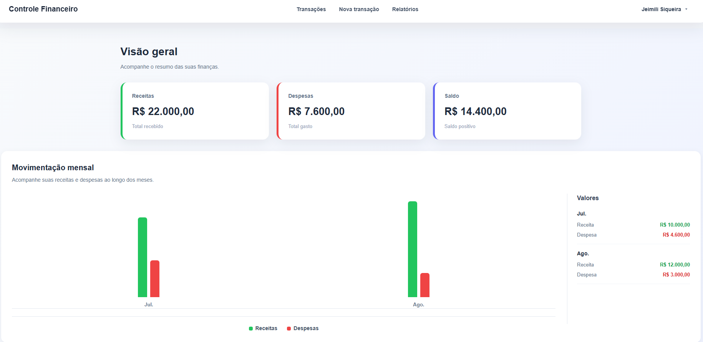
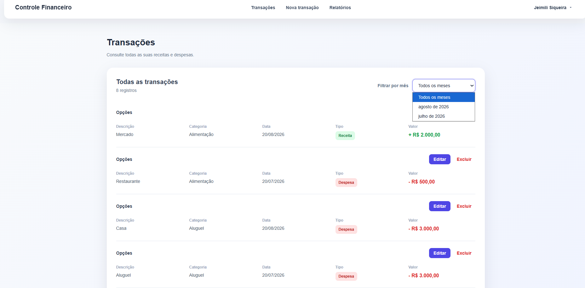
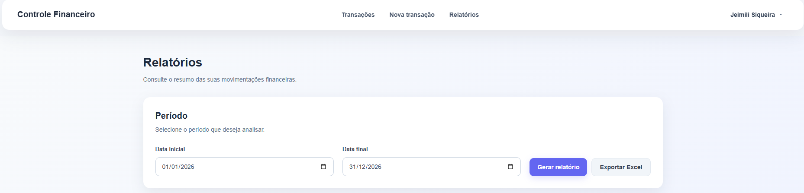

# Controle Financeiro — Frontend

Frontend da aplicação **Controle Financeiro**, desenvolvido com **React e TypeScript** para gerenciamento de receitas e despesas pessoais.

O projeto faz parte do meu portfólio de desenvolvimento e foi construído com foco em integração com API REST, autenticação, organização de componentes, gerenciamento de rotas e construção de uma interface moderna e responsiva.

## Sobre o projeto

A aplicação permite que usuários autenticados acompanhem e gerenciem suas movimentações financeiras através de uma interface web integrada à API desenvolvida em **C# e .NET 10**.

A comunicação entre frontend e backend é realizada através de requisições HTTP utilizando **Axios**, com autenticação baseada em **JWT**.

## Principais funcionalidades

### Autenticação

* Cadastro de usuários
* Login
* Autenticação utilizando JWT
* Armazenamento da sessão no navegador
* Proteção das requisições autenticadas

### Dashboard

* Visualização do total de receitas
* Visualização do total de despesas
* Visualização do saldo
* Resumo financeiro
* Gráfico de movimentações
* Visualização das movimentações recentes

### Transações

* Cadastro de receitas e despesas
* Edição de transações
* Exclusão de transações
* Listagem de transações
* Visualização de categoria, data, tipo e valor
* Filtro de transações por mês
* Identificação visual entre receitas e despesas

### Relatórios

* Seleção de período para geração do relatório
* Visualização do total de receitas
* Visualização do total de despesas
* Visualização do saldo
* Resumo financeiro mensal
* Detalhamento das transações
* Exportação do relatório para Excel

### Interface

* Interface desenvolvida com React e CSS
* Layout responsivo
* Navegação através de React Router
* Feedback visual para erros
* Organização das páginas e componentes
* Interface adaptada para diferentes tamanhos de tela

## Interface da aplicação

### Dashboard



### Transações



### Relatórios



## Tecnologias utilizadas

* React
* TypeScript
* Vite
* Axios
* React Router
* CSS
* HTML
* Git / GitHub

## Estrutura do projeto

```text
frontend/
│
├── public/
│
├── src/
│   ├── assets/
│   │
│   ├── components/
│   │   ├── Navbar.tsx
│   │   └── Navbar.css
│   │
│   ├── pages/
│   │   ├── Cadastro.tsx
│   │   ├── Cadastro.css
│   │   ├── Dashboard.tsx
│   │   ├── Dashboard.css
│   │   ├── EditarTransacao.tsx
│   │   ├── Login.tsx
│   │   ├── Login.css
│   │   ├── NovaTransacao.tsx
│   │   ├── NovaTransacao.css
│   │   ├── Relatorios.tsx
│   │   ├── Relatorios.css
│   │   ├── Transacoes.tsx
│   │   └── Transacoes.css
│   │
│   ├── services/
│   │   ├── api.ts
│   │   └── relatorioService.ts
│   │
│   ├── App.tsx
│   ├── App.css
│   └── index.css
│
├── screenshots/
│   ├── dashboard.png
│   ├── transacao.png
│   └── relatorio.png
│
├── package.json
├── package-lock.json
├── tsconfig.json
└── vite.config.ts
```

## Integração com o Backend

O frontend utiliza **Axios** para realizar as requisições à API.

Entre as principais operações estão:

```http
POST   /api/Auth/register
POST   /api/Auth/login
GET    /api/Auth/me

GET    /api/Transacoes
GET    /api/Transacoes/{id}
POST   /api/Transacoes
PUT    /api/Transacoes/{id}
DELETE /api/Transacoes/{id}

GET    /api/Relatorios
GET    /api/Relatorios/exportar
```

Após o login, o token JWT é armazenado no navegador e enviado nas requisições que exigem autenticação.

## Como executar o projeto

### Pré-requisitos

Antes de executar o projeto, tenha instalado:

* Node.js
* npm
* Git

### 1. Clone o repositório

```bash
git clone https://github.com/JeiSiqueira/Controle_Financeiro-Frontend.git
```

### 2. Entre na pasta

```bash
cd Controle_Financeiro-Frontend
```

### 3. Instale as dependências

```bash
npm install
```

### 4. Execute o projeto

```bash
npm run dev
```

A aplicação será disponibilizada pelo Vite, normalmente em:

```text
http://localhost:5173
```

## Backend

Este frontend depende da API do projeto **Controle Financeiro**.

O backend foi desenvolvido utilizando:

* C#
* .NET 10
* ASP.NET Core Web API
* Entity Framework Core
* MySQL
* JWT
* Swagger / OpenAPI
* ClosedXML

[Repositório do Backend](https://github.com/JeiSiqueira/Controle_Financeiro)

## Objetivo do projeto

Este projeto foi desenvolvido para colocar em prática conhecimentos em desenvolvimento web e construção de aplicações completas, envolvendo frontend, backend e banco de dados.

Entre os principais conhecimentos aplicados estão:

* Desenvolvimento com React
* TypeScript
* Consumo de APIs REST
* Autenticação JWT
* React Router
* Axios
* Gerenciamento de estado com React Hooks
* Desenvolvimento de interfaces responsivas
* Organização de componentes e páginas
* Integração entre frontend e backend
* Git e GitHub

Desenvolvido por **Jeimili Siqueira Mendes**.
